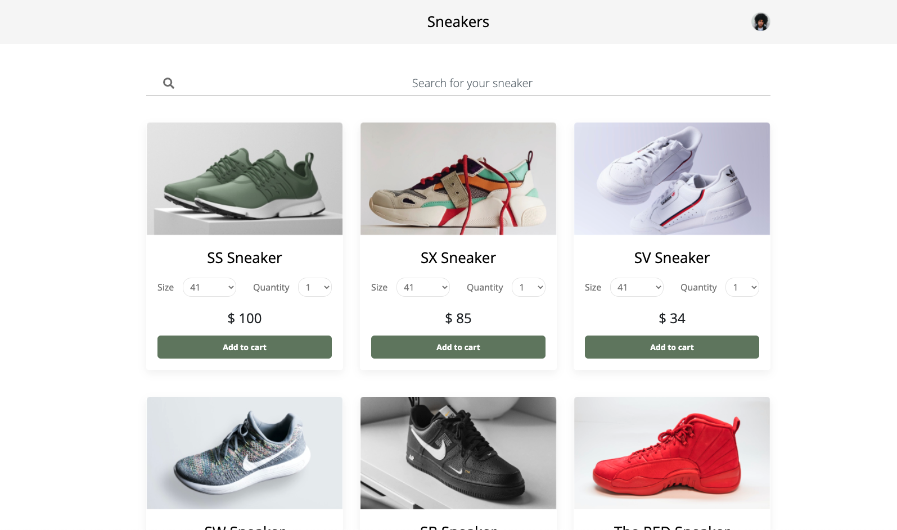

# Vue Bookstore

A storefrontend app made with React, Redux, styled-components and Trustly's payment API.

]

## Environment setup

- [Git](https://git-scm.com/)
- [Node.js](https://nodejs.org/en/)
- [NPM](https://www.npmjs.com/)

## Running the project

1 - Clone this repository to your machine

```
git clone https://github.com/gabrielcolombo/react-checkout
```

2 - Navigate into the project's folder

```
cd react-checkout
```

3 - Install the project's dependencies

```
npm install
```

4 - Start the development server

```
npm start
```

5 - Navigate to the home page using your browser of choice

```
http://localhost:3000
```

## Technologies used

- Framework: [React](https://reactjs.org/)
- State management: [Redux](https://redux.js.org/)
- Routing: [React Router](https://reactrouter.com/)
- HTTP client: [Fetch API](https://developer.mozilla.org/en-US/docs/Web/API/Fetch_API)
- Styling: [styled-components](https://styled-components.com/)
- Fonts: [Google Fonts](https://fonts.google.com/)
- API: [Trustly](https://developers.trustly.com/emea/docs/welcome)

## Roadmap

- [x] Home page
- [x] Checkout page
- [x] API integration
- [ ] Unit tests
